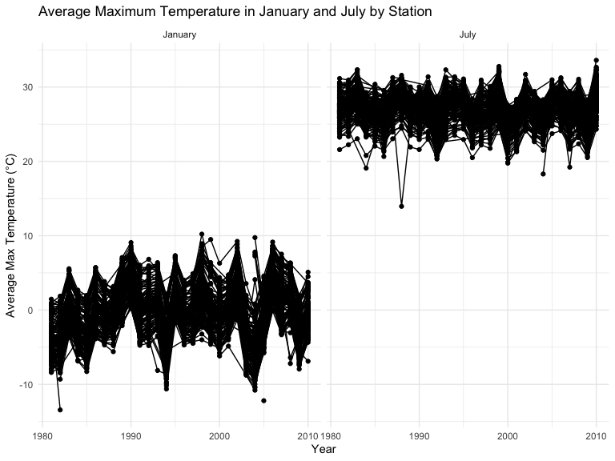
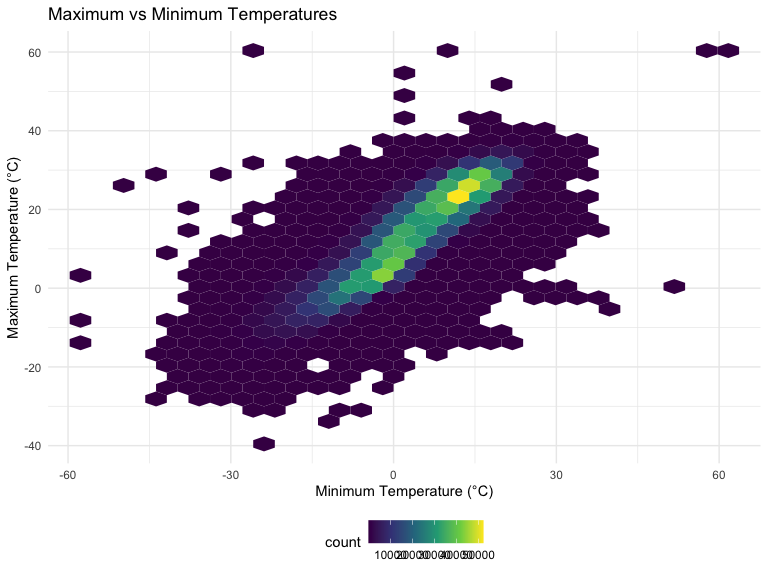
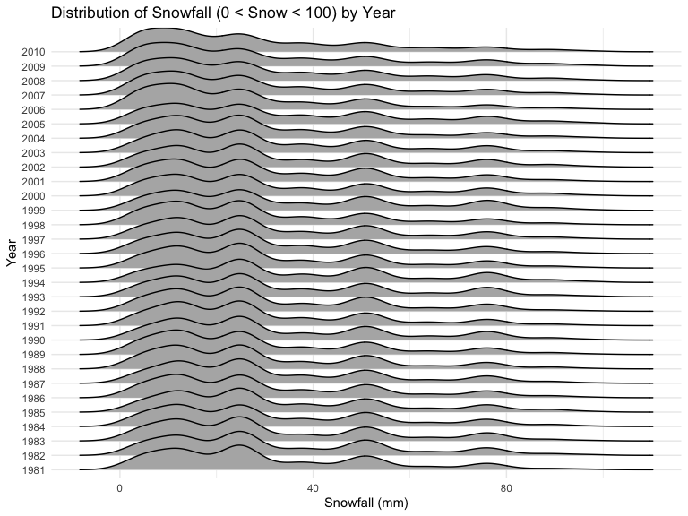
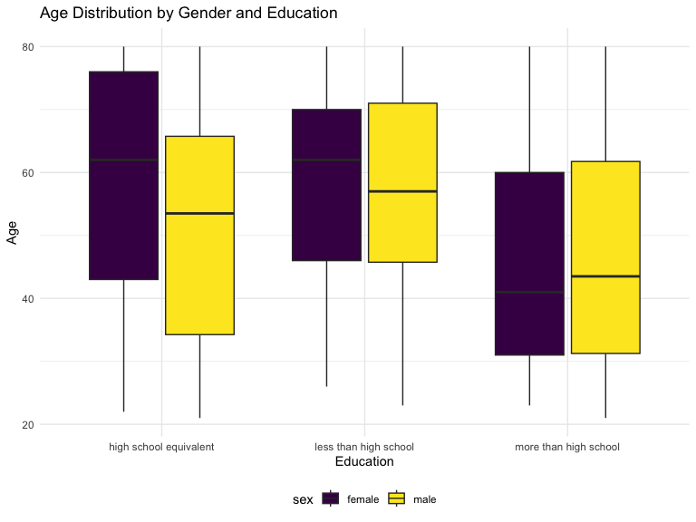
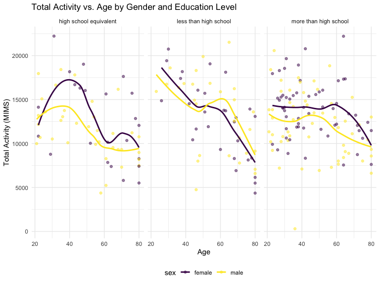

P8105 Homework 3
================
Shehzrin Shah
2024-10-12

## Problem 1

Loading the data from the `p8105.datasets` package:

``` r
data("ny_noaa")
summary(ny_noaa)
```

    ##       id                 date                 prcp               snow       
    ##  Length:2595176     Min.   :1981-01-01   Min.   :    0.00   Min.   :  -13   
    ##  Class :character   1st Qu.:1988-11-29   1st Qu.:    0.00   1st Qu.:    0   
    ##  Mode  :character   Median :1997-01-21   Median :    0.00   Median :    0   
    ##                     Mean   :1997-01-01   Mean   :   29.82   Mean   :    5   
    ##                     3rd Qu.:2005-09-01   3rd Qu.:   23.00   3rd Qu.:    0   
    ##                     Max.   :2010-12-31   Max.   :22860.00   Max.   :10160   
    ##                                          NA's   :145838     NA's   :381221  
    ##       snwd            tmax               tmin          
    ##  Min.   :   0.0   Length:2595176     Length:2595176    
    ##  1st Qu.:   0.0   Class :character   Class :character  
    ##  Median :   0.0   Mode  :character   Mode  :character  
    ##  Mean   :  37.3                                        
    ##  3rd Qu.:   0.0                                        
    ##  Max.   :9195.0                                        
    ##  NA's   :591786

The dataset being explored is the `ny_noaa` dataset from the
`p8105.datasets` package. It contains a total of 2595176 rows and 7
columns, representing daily weather observations from various locations
in New York state. The columns include:

- `id`: a station identifier
- `date`: the date of the observation
- `prcp`: precipitation (tenths of mm)
- `snow`: snowfall (mm)
- `snwd`: snow depth (mm)
- `tmax`: maximum temperature (tenths of degrees C)
- `tmin`: minimum temperature (tenths of degrees C)

Looking at the original dataset, we see it contains substantial amount
of missing data (lots of `NA` values across variables as seen from data
and `summary` command). There are 3387623 missing values in the dataset.

### Data cleaning:

``` r
noaatidy_df = ny_noaa |>
  janitor::clean_names() |>
  separate(date, into = c("year", "month", "day"), convert = TRUE) |>
  mutate(
    prcp = prcp / 10 ,
    tmax = as.numeric(tmax) / 10,
    tmin = as.numeric(tmin) / 10,
    year = as.numeric(year),
    day = as.numeric(day),
    month = recode_factor(month,
          "01" = "January",
          "02" = "February",
          "03" = "March",
          "04" = "April",
          "05" = "May",
          "06" = "June",
          "07" = "July",
          "08" = "August",
          "09" = "September",
          "10" = "October",
          "11" = "November",
          "12" = "December"
    ))
```

In the data cleaning step, we cleaned the variables names, created
separate variables for year, month, and day, and converted these
variables to numeric variables. Additionally, variables measured in
tenths of units were converted into just units (e.g., `tmin` was
measured in tenths of degrees C and converted into degrees C).

``` r
noaatidy_df |>
  count(snow) |>
  arrange(desc(n))
```

    ## # A tibble: 282 × 2
    ##     snow       n
    ##    <int>   <int>
    ##  1     0 2008508
    ##  2    NA  381221
    ##  3    25   31022
    ##  4    13   23095
    ##  5    51   18274
    ##  6    76   10173
    ##  7     8    9962
    ##  8     5    9748
    ##  9    38    9197
    ## 10     3    8790
    ## # ℹ 272 more rows

For snowfall, the most commonly observed value is O (no recorded
snowfall on most days in NY state). This makes sense because snowfall
only occurs during certain times of the year and in specific conditions
(i.e., there are many days with no snowfall, and a small window for
possible snow). The second most commonly observed value is `NA`,
suggesting missingness.

### Making two-panel plot:

``` r
avg_temp_df = noaatidy_df |>
  filter(month %in% c("January", "July")) |>
  group_by(id, year, month) |>
  summarize(avg_tmax = mean(tmax, na.rm = TRUE))
```

    ## `summarise()` has grouped output by 'id', 'year'. You can override using the
    ## `.groups` argument.

``` r
ggplot(avg_temp_df, aes(x = year, y = avg_tmax, group = id)) + geom_point() + geom_path() +
  facet_grid(. ~ month) +
  labs(
    title = "Average Maximum Temperature in January and July by Station",
    x = "Year",
    y = "Average Max Temperature (°C)",
  ) 
```


The two-panel plot shows the average maximum temperature in January and
July across years by station. July temperatures remain stable around
25–30°C, with fewer outliers (e.g., one possible at about 14ºC), overall
ranging from about 20ºC and 35ºC. Seasonal patterns are evident in
January, while July shows less variation. January temperatures fluctuate
more (within approximately -10 to 10ºC), with some potential outliers
(e.g., lowest max temperature at about -14ºC). There does not appear to
be a significant difference in average max temperatures in July or
January throughout the years. The average temperatures in January
(winter month) are also lower than in July (summer month). All stations
appear to follow similar trends of temperature peaks and valleys within
a month across the years.

### Making more two-panel plots:

``` r
tmax_tmin_df = noaatidy_df |>
  ggplot(aes(x = tmin, y = tmax)) +
  geom_hex() +
  labs(
    title = "Maximum vs Minimum Temperatures",
    x = "Minimum Temperature (°C)",
    y = "Maximum Temperature (°C)"
  )

tmax_tmin_df
```



``` r
snowfall_df = noaatidy_df |>
  filter(snow > 0, snow < 100) %>% 
  ggplot(aes(x = snow, y = as.factor(year))) +
  geom_density_ridges() +
  labs(
    title = "Distribution of Snowfall (0 < Snow < 100) by Year",
    x = "Snowfall (mm)",
    y = "Year"
  )

snowfall_df
```

    ## Picking joint bandwidth of 3.76



The first two-panel plot (hex plot) shows the `tmax` vs `tmin` for the
full dataset. The plot shows denser regions at moderate maximum
temperatures (around 0ºC to 35ºC) and minimum temperatures (around -10ºC
to 20ºC), suggesting most observations fall within that range. The
majority of the data cluster tightly in the center of the distribution.

The second two-panel plot shows the distribution of snowfall (values
greater than 0 and less than 100) separately by year. The ridgeline plot
shows a multimodal density of snowfall within a given year and
distributions across years with most snowfall events concentrated around
0-35mm. There is a another group of stations that see about 45mm of snow
and another group that sees nearly 80 mm. The overall patterns suggests
a fairly consistent distribution of snowfall values with some
variability across the years.

## Problem 2

``` r
covar_df = read_csv("nhanes_covar.csv", na = c("NA", ".", ""), skip = 4) |> 
  janitor::clean_names() |>
  filter(age >= 21) |>
  mutate(
    sex = case_match(
      sex, 
      1 ~ "male",
      2 ~ "female"),
    education = case_match(
      education, 
      1 ~ "less than high school",
      2 ~ "high school equivalent",
      3 ~ "more than high school"),
    age = as.numeric(age),  
    BMI = as.numeric(bmi)
  )
```

    ## Rows: 250 Columns: 5
    ## ── Column specification ────────────────────────────────────────────────────────
    ## Delimiter: ","
    ## dbl (5): SEQN, sex, age, BMI, education
    ## 
    ## ℹ Use `spec()` to retrieve the full column specification for this data.
    ## ℹ Specify the column types or set `show_col_types = FALSE` to quiet this message.

``` r
accel_df = read_csv("nhanes_accel.csv", na = c("NA", ".", "")) |> 
  janitor::clean_names() |>
  pivot_longer(
    min1:min1440,
    names_to = "min",
    values_to = "mims",
    names_prefix = "min"
  ) |>
  mutate(
    min = as.numeric(min)
  )
```

    ## Rows: 250 Columns: 1441
    ## ── Column specification ────────────────────────────────────────────────────────
    ## Delimiter: ","
    ## dbl (1441): SEQN, min1, min2, min3, min4, min5, min6, min7, min8, min9, min1...
    ## 
    ## ℹ Use `spec()` to retrieve the full column specification for this data.
    ## ℹ Specify the column types or set `show_col_types = FALSE` to quiet this message.

``` r
mims_df = 
  left_join(
    covar_df, accel_df, by = c("seqn"))
```

Accelerometer data was collected on 250 participants in the NHANES
study. I loaded, tidied, merged, and organized two datasets to create a
single `mims_df` dataset. The first dataset, `nhanes_covar`, contained
participants’ demographic data, and the second dataset, `nhanes_accel`
contained their accelerometer data. The final dataset includes all
originally observed variables, excludes participants less than 21 years
of age (and those with missing demographic data), and encodes data with
reasonable variable classes (i.e., not numeric, and using factors with
the ordering of tables and plots in mind). The resulting dataset has
332640 rows and 8 columns.

``` r
mims_df |>
  group_by(sex, education) |>
  distinct(seqn) |>
  summarize(count = n()) |>
  knitr::kable()
```

    ## `summarise()` has grouped output by 'sex'. You can override using the `.groups`
    ## argument.

| sex    | education              | count |
|:-------|:-----------------------|------:|
| female | high school equivalent |    23 |
| female | less than high school  |    29 |
| female | more than high school  |    59 |
| male   | high school equivalent |    36 |
| male   | less than high school  |    28 |
| male   | more than high school  |    56 |

The above is a reader-friendly table for the number of men and women in
each education category. We can see a summary of participants by sex
(male or female) and education level (less than high school, high school
equivalent, more than high school). For example, 23 females have a high
school equivalent education, and 56 males have more than a high school
education.

``` r
mims_df |>
   ggplot(aes(x = education, y = age, fill = sex)) +
  geom_boxplot() + 
  labs(title = "Age Distribution by Gender and Education",
       y = "Age", 
       x = "Education") 
```



``` r
str(mims_df)
```

    ## tibble [332,640 × 8] (S3: tbl_df/tbl/data.frame)
    ##  $ seqn     : num [1:332640] 62161 62161 62161 62161 62161 ...
    ##  $ sex      : chr [1:332640] "male" "male" "male" "male" ...
    ##  $ age      : num [1:332640] 22 22 22 22 22 22 22 22 22 22 ...
    ##  $ bmi      : num [1:332640] 23.3 23.3 23.3 23.3 23.3 23.3 23.3 23.3 23.3 23.3 ...
    ##  $ education: chr [1:332640] "high school equivalent" "high school equivalent" "high school equivalent" "high school equivalent" ...
    ##  $ BMI      : num [1:332640] 23.3 23.3 23.3 23.3 23.3 23.3 23.3 23.3 23.3 23.3 ...
    ##  $ min      : num [1:332640] 1 2 3 4 5 6 7 8 9 10 ...
    ##  $ mims     : num [1:332640] 1.106 3.115 1.468 0.938 1.599 ...

The boxplot visualization shows the age distribution for men and women
in different education categories. In the “less than high school” and
“high school equivalent” categories, females have a slightly higher
median age compared to males. In the “more than high school” category,
the median ages of men and women are quite similar (with the male median
age slightly higher), both around the mid-40s. There is also
considerable overlap in the age distributions of men and women across
all education categories (i.e., age patterns between the sexes remain
somewhat consistent regardless of education level).

``` r
total_activity_df = mims_df |>
  group_by(seqn, age, sex, education) |>
  summarize(total_activity = sum(mims, na.rm = TRUE))
```

    ## `summarise()` has grouped output by 'seqn', 'age', 'sex'. You can override
    ## using the `.groups` argument.

``` r
total_activity_df |>
  ggplot(aes(x = age, y = total_activity, color = sex)) +
  geom_point(alpha = 0.5) +
  geom_smooth(method = "loess", se = FALSE) + 
  facet_wrap(~ education) +
  labs(
    title = "Total Activity vs. Age by Gender and Education Level",
    x = "Age",
    y = "Total Activity (MIMS)",
  ) 
```

    ## `geom_smooth()` using formula = 'y ~ x'


I created a total activity variable for each participant, and plotted
these total activities (y-axis) against age (x-axis). The plot compares
men to women for each education level. Generally, across all education
levels, total activity tends to decrease with age. Within each education
level, females and males tend to follow similar patterns in changes in
total activity as they age. Generally, females have more total activity
than males, with some small exceptions (e.g., the “less than high
school” education level shows males with higher total activity, in
general, after the age of approximately 50).
