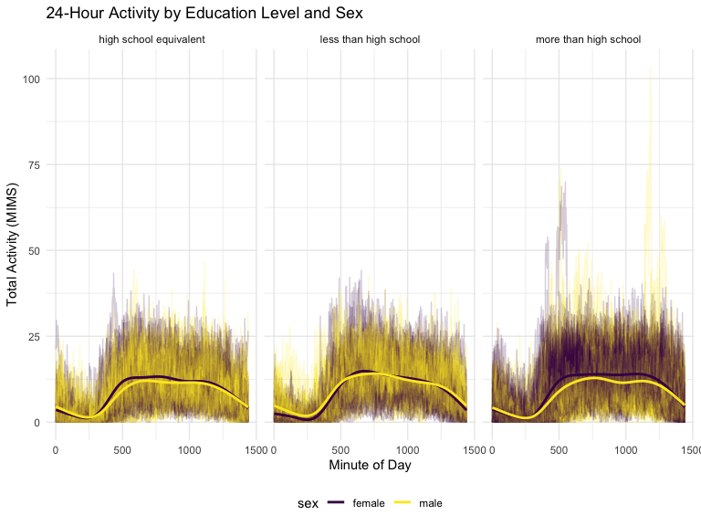
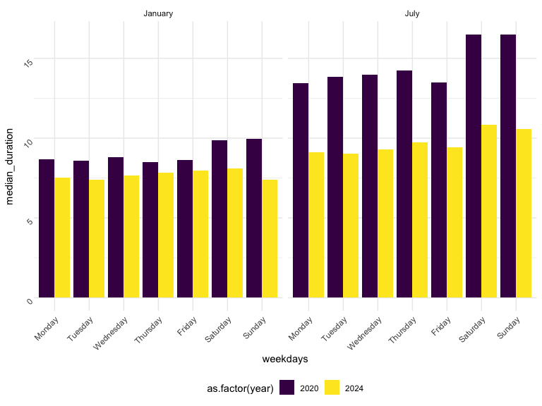
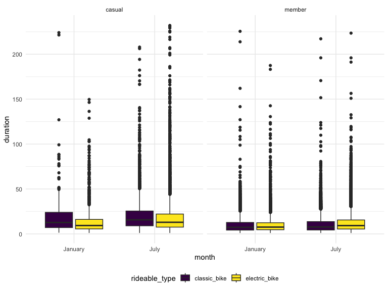
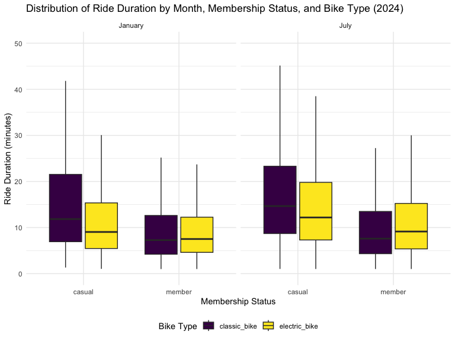

P8105 Homework 3
================
Shehzrin Shah
2024-10-12

## Problem 1

Loading the data from the `p8105.datasets` package:

``` r
data("ny_noaa")
summary(ny_noaa)
```

    ##       id                 date                 prcp               snow       
    ##  Length:2595176     Min.   :1981-01-01   Min.   :    0.00   Min.   :  -13   
    ##  Class :character   1st Qu.:1988-11-29   1st Qu.:    0.00   1st Qu.:    0   
    ##  Mode  :character   Median :1997-01-21   Median :    0.00   Median :    0   
    ##                     Mean   :1997-01-01   Mean   :   29.82   Mean   :    5   
    ##                     3rd Qu.:2005-09-01   3rd Qu.:   23.00   3rd Qu.:    0   
    ##                     Max.   :2010-12-31   Max.   :22860.00   Max.   :10160   
    ##                                          NA's   :145838     NA's   :381221  
    ##       snwd            tmax               tmin          
    ##  Min.   :   0.0   Length:2595176     Length:2595176    
    ##  1st Qu.:   0.0   Class :character   Class :character  
    ##  Median :   0.0   Mode  :character   Mode  :character  
    ##  Mean   :  37.3                                        
    ##  3rd Qu.:   0.0                                        
    ##  Max.   :9195.0                                        
    ##  NA's   :591786

The dataset being explored is the `ny_noaa` dataset from the
`p8105.datasets` package. It contains a total of 2595176 rows and 7
columns, representing daily weather observations from various locations
in New York state. The columns include:

- `id`: a station identifier
- `date`: the date of the observation
- `prcp`: precipitation (tenths of mm)
- `snow`: snowfall (mm)
- `snwd`: snow depth (mm)
- `tmax`: maximum temperature (tenths of degrees C)
- `tmin`: minimum temperature (tenths of degrees C)

Looking at the original dataset, we see it contains substantial amount
of missing data (lots of `NA` values across variables as seen from data
and `summary` command). There are 3387623 missing values in the dataset.

### Data cleaning:

``` r
noaatidy_df = ny_noaa |>
  janitor::clean_names() |>
  separate(date, into = c("year", "month", "day"), convert = TRUE) |>
  mutate(
    prcp = prcp / 10 ,
    tmax = as.numeric(tmax) / 10,
    tmin = as.numeric(tmin) / 10,
    year = as.numeric(year),
    day = as.numeric(day),
    month = recode_factor(month,
          "01" = "January",
          "02" = "February",
          "03" = "March",
          "04" = "April",
          "05" = "May",
          "06" = "June",
          "07" = "July",
          "08" = "August",
          "09" = "September",
          "10" = "October",
          "11" = "November",
          "12" = "December"
    ))
```

In the data cleaning step, we cleaned the variables names, created
separate variables for year, month, and day, and converted these
variables to numeric variables. Additionally, variables measured in
tenths of units were converted into just units (e.g., `tmin` was
measured in tenths of degrees C and converted into degrees C).

``` r
noaatidy_df |>
  count(snow) |>
  arrange(desc(n))
```

    ## # A tibble: 282 × 2
    ##     snow       n
    ##    <int>   <int>
    ##  1     0 2008508
    ##  2    NA  381221
    ##  3    25   31022
    ##  4    13   23095
    ##  5    51   18274
    ##  6    76   10173
    ##  7     8    9962
    ##  8     5    9748
    ##  9    38    9197
    ## 10     3    8790
    ## # ℹ 272 more rows

For snowfall, the most commonly observed value is O (no recorded
snowfall on most days in NY state). This makes sense because snowfall
only occurs during certain times of the year and in specific conditions
(i.e., there are many days with no snowfall, and a small window for
possible snow). The second most commonly observed value is `NA`,
suggesting missingness.

### Making two-panel plot:

``` r
avg_temp_df = noaatidy_df |>
  filter(month %in% c("January", "July")) |>
  group_by(id, year, month) |>
  summarize(avg_tmax = mean(tmax, na.rm = TRUE))
```

    ## `summarise()` has grouped output by 'id', 'year'. You can override using the
    ## `.groups` argument.

``` r
ggplot(avg_temp_df, aes(x = year, y = avg_tmax, group = id)) + geom_point() + geom_path() +
  facet_grid(. ~ month) +
  labs(
    title = "Average Maximum Temperature in January and July by Station",
    x = "Year",
    y = "Average Max Temperature (°C)",
  ) 
```


The two-panel plot shows the average maximum temperature in January and
July across years by station. July temperatures remain stable around
25–30°C, with fewer outliers (e.g., one possible at about 14ºC), overall
ranging from about 20ºC and 35ºC. Seasonal patterns are evident in
January, while July shows less variation. January temperatures fluctuate
more (within approximately -10 to 10ºC), with some potential outliers
(e.g., lowest max temperature at about -14ºC). There does not appear to
be a significant difference in average max temperatures in July or
January throughout the years. The average temperatures in January
(winter month) are also lower than in July (summer month). All stations
appear to follow similar trends of temperature peaks and valleys within
a month across the years.

### Making more two-panel plots:

``` r
tmax_tmin_df = noaatidy_df |>
  ggplot(aes(x = tmin, y = tmax)) +
  geom_hex() +
  labs(
    title = "Maximum vs Minimum Temperatures",
    x = "Minimum Temperature (°C)",
    y = "Maximum Temperature (°C)"
  )

tmax_tmin_df
```


``` r
snowfall_df = noaatidy_df |>
  filter(snow > 0, snow < 100) %>% 
  ggplot(aes(x = snow, y = as.factor(year))) +
  geom_density_ridges() +
  labs(
    title = "Distribution of Snowfall (0 < Snow < 100) by Year",
    x = "Snowfall (mm)",
    y = "Year"
  )

snowfall_df
```

    ## Picking joint bandwidth of 3.76


The first two-panel plot (hex plot) shows the `tmax` vs `tmin` for the
full dataset. The plot shows denser regions at moderate maximum
temperatures (around 0ºC to 35ºC) and minimum temperatures (around -10ºC
to 20ºC), suggesting most observations fall within that range. The
majority of the data cluster tightly in the center of the distribution.

The second two-panel plot shows the distribution of snowfall (values
greater than 0 and less than 100) separately by year. The ridgeline plot
shows a multimodal density of snowfall within a given year and
distributions across years with most snowfall events concentrated around
0-35mm. There is a another group of stations that see about 45mm of snow
and another group that sees nearly 80 mm. The overall patterns suggests
a fairly consistent distribution of snowfall values with some
variability across the years.

## Problem 2

``` r
covar_df = read_csv("nhanes_covar.csv", na = c("NA", ".", ""), skip = 4) |> 
  janitor::clean_names() |>
  filter(age >= 21) |>
  mutate(
    sex = case_match(
      sex, 
      1 ~ "male",
      2 ~ "female"),
    education = case_match(
      education, 
      1 ~ "less than high school",
      2 ~ "high school equivalent",
      3 ~ "more than high school"),
    age = as.numeric(age),  
    BMI = as.numeric(bmi)
  )
```

    ## Rows: 250 Columns: 5
    ## ── Column specification ────────────────────────────────────────────────────────
    ## Delimiter: ","
    ## dbl (5): SEQN, sex, age, BMI, education
    ## 
    ## ℹ Use `spec()` to retrieve the full column specification for this data.
    ## ℹ Specify the column types or set `show_col_types = FALSE` to quiet this message.

``` r
accel_df = read_csv("nhanes_accel.csv", na = c("NA", ".", "")) |> 
  janitor::clean_names() |>
  pivot_longer(
    min1:min1440,
    names_to = "min",
    values_to = "mims",
    names_prefix = "min"
  ) |>
  mutate(
    min = as.numeric(min)
  )
```

    ## Rows: 250 Columns: 1441
    ## ── Column specification ────────────────────────────────────────────────────────
    ## Delimiter: ","
    ## dbl (1441): SEQN, min1, min2, min3, min4, min5, min6, min7, min8, min9, min1...
    ## 
    ## ℹ Use `spec()` to retrieve the full column specification for this data.
    ## ℹ Specify the column types or set `show_col_types = FALSE` to quiet this message.

``` r
mims_df = 
  left_join(
    covar_df, accel_df, by = c("seqn"))
```

Accelerometer data was collected on 250 participants in the NHANES
study. I loaded, tidied, merged, and organized two datasets to create a
single `mims_df` dataset. The first dataset, `nhanes_covar`, contained
participants’ demographic data, and the second dataset, `nhanes_accel`
contained their accelerometer data. The final dataset includes all
originally observed variables, excludes participants less than 21 years
of age (and those with missing demographic data), and encodes data with
reasonable variable classes (i.e., not numeric, and using factors with
the ordering of tables and plots in mind). The resulting dataset has
332640 rows and 8 columns.

``` r
mims_df |>
  group_by(sex, education) |>
  distinct(seqn) |>
  summarize(count = n()) |>
  knitr::kable()
```

    ## `summarise()` has grouped output by 'sex'. You can override using the `.groups`
    ## argument.

| sex    | education              | count |
|:-------|:-----------------------|------:|
| female | high school equivalent |    23 |
| female | less than high school  |    29 |
| female | more than high school  |    59 |
| male   | high school equivalent |    36 |
| male   | less than high school  |    28 |
| male   | more than high school  |    56 |

The above is a reader-friendly table for the number of men and women in
each education category. We can see a summary of participants by sex
(`male` or `female`) and education level (`less than high school`,
`high school equivalent`, `more than high school`). For example, 23
females have a high school equivalent education, and 56 males have more
than a high school education.

``` r
mims_df |>
   ggplot(aes(x = education, y = age, fill = sex)) +
  geom_boxplot() + 
  labs(title = "Age Distribution by Gender and Education",
       y = "Age", 
       x = "Education") 
```


``` r
str(mims_df)
```

    ## tibble [332,640 × 8] (S3: tbl_df/tbl/data.frame)
    ##  $ seqn     : num [1:332640] 62161 62161 62161 62161 62161 ...
    ##  $ sex      : chr [1:332640] "male" "male" "male" "male" ...
    ##  $ age      : num [1:332640] 22 22 22 22 22 22 22 22 22 22 ...
    ##  $ bmi      : num [1:332640] 23.3 23.3 23.3 23.3 23.3 23.3 23.3 23.3 23.3 23.3 ...
    ##  $ education: chr [1:332640] "high school equivalent" "high school equivalent" "high school equivalent" "high school equivalent" ...
    ##  $ BMI      : num [1:332640] 23.3 23.3 23.3 23.3 23.3 23.3 23.3 23.3 23.3 23.3 ...
    ##  $ min      : num [1:332640] 1 2 3 4 5 6 7 8 9 10 ...
    ##  $ mims     : num [1:332640] 1.106 3.115 1.468 0.938 1.599 ...

The boxplot visualization shows the age distribution for men and women
in different education categories. In the `less than high school` and
`high school equivalent` categories, females have a slightly higher
median age compared to males. In the “more than high school” category,
the median ages of men and women are quite similar (with the male median
age slightly higher), both around the mid-40s. There is also
considerable overlap in the age distributions of men and women across
all education categories (i.e., age patterns between the sexes remain
somewhat consistent regardless of education level).

``` r
total_activity_df = mims_df |>
  group_by(seqn, age, sex, education) |>
  summarize(total_activity = sum(mims, na.rm = TRUE))
```

    ## `summarise()` has grouped output by 'seqn', 'age', 'sex'. You can override
    ## using the `.groups` argument.

``` r
total_activity_df |>
  ggplot(aes(x = age, y = total_activity, color = sex)) +
  geom_point(alpha = 0.5) +
  geom_smooth(method = "loess", se = FALSE) + 
  facet_wrap(~ education) +
  labs(
    title = "Total Activity vs. Age by Gender and Education Level",
    x = "Age",
    y = "Total Activity (MIMS)",
  ) 
```

    ## `geom_smooth()` using formula = 'y ~ x'


I created a `total_activity_df` variable for each participant, and
plotted these total activities (y-axis) against age (x-axis). The plot
compares men to women for each education level. Generally, across all
education levels, total activity tends to decrease with age. Within each
education level, females and males tend to follow similar patterns in
changes in total activity as they age. Generally, females have more
total activity than males, with some small exceptions (e.g., the
`less than high school` education level shows males with higher total
activity, in general, after the age of approximately 50).

``` r
ggplot(mims_df, aes(x = min, y = mims, group = seqn, color = sex)) +
  geom_line(alpha = .2) +
  geom_smooth(aes(group = sex), se = FALSE) +
  facet_grid(. ~ education) +
  labs(
    title = "24-Hour Activity by Education Level and Sex",
    x = "Minute of Day",
    y = "Total Activity (MIMS)",
  )
```

    ## `geom_smooth()` using method = 'gam' and formula = 'y ~ s(x, bs = "cs")'



I created a three-panel plot showing the 24-hour activity time courses
for each education level (color indicates sex). All groups show similar
daily activity trend (i.e., peaking in the morning/late afternoon at
around 750 minutes, suggests that participants are most active at these
times, with low activity during nighttime hours). For both
`less than high school` and `high school equivalent` education levels,
males and females show similar activity patterns throughout the day
(same for `more than high school`, but seems females consistently are
more active than males starting at about 250 minutes up until near the
end of the day). Those with `more than high school` education show the
most pronounced activity spikes (heightened physical engagement)
especially in the late morning and early afternoon.

## Problem 3

``` r
jan2020_df = 
   read_csv("citibike/Jan 2020 Citi.csv", na = c("NA",".","")) |>
  janitor::clean_names() |>
  mutate(year = 2020,
         month = "January") |>
   relocate(year, month, .before = ride_id)
```

    ## Rows: 12420 Columns: 7
    ## ── Column specification ────────────────────────────────────────────────────────
    ## Delimiter: ","
    ## chr (6): ride_id, rideable_type, weekdays, start_station_name, end_station_n...
    ## dbl (1): duration
    ## 
    ## ℹ Use `spec()` to retrieve the full column specification for this data.
    ## ℹ Specify the column types or set `show_col_types = FALSE` to quiet this message.

``` r
jan2024_df = 
   read_csv("citibike/Jan 2024 Citi.csv", na = c("NA",".","")) |>
  janitor::clean_names() |>
  mutate(year = 2024,
         month = "January") |>
   relocate(year, month, .before = ride_id)
```

    ## Rows: 18861 Columns: 7
    ## ── Column specification ────────────────────────────────────────────────────────
    ## Delimiter: ","
    ## chr (6): ride_id, rideable_type, weekdays, start_station_name, end_station_n...
    ## dbl (1): duration
    ## 
    ## ℹ Use `spec()` to retrieve the full column specification for this data.
    ## ℹ Specify the column types or set `show_col_types = FALSE` to quiet this message.

``` r
july2020_df = 
   read_csv("citibike/July 2020 Citi.csv", na = c("NA",".","")) |>
  janitor::clean_names() |>
  mutate(year = 2020,
         month = "July") |>
   relocate(year, month, .before = ride_id)
```

    ## Rows: 21048 Columns: 7
    ## ── Column specification ────────────────────────────────────────────────────────
    ## Delimiter: ","
    ## chr (6): ride_id, rideable_type, weekdays, start_station_name, end_station_n...
    ## dbl (1): duration
    ## 
    ## ℹ Use `spec()` to retrieve the full column specification for this data.
    ## ℹ Specify the column types or set `show_col_types = FALSE` to quiet this message.

``` r
july2024_df = 
   read_csv("citibike/July 2024 Citi.csv", na = c("NA",".","")) |>
  janitor::clean_names() |>
  mutate(year = 2024,
         month = "July") |>
   relocate(year, month, .before = ride_id)
```

    ## Rows: 47156 Columns: 7
    ## ── Column specification ────────────────────────────────────────────────────────
    ## Delimiter: ","
    ## chr (6): ride_id, rideable_type, weekdays, start_station_name, end_station_n...
    ## dbl (1): duration
    ## 
    ## ℹ Use `spec()` to retrieve the full column specification for this data.
    ## ℹ Specify the column types or set `show_col_types = FALSE` to quiet this message.

``` r
citibike_df = bind_rows(jan2020_df, july2020_df, jan2024_df, july2024_df) |>
  mutate(
    weekdays = factor(weekdays, levels = c("Monday","Tuesday","Wednesday","Thursday","Friday","Saturday","Sunday"), ordered = TRUE))
```

I merged four datasets that each contained 1% of all NYC Citi Bike
system rides with a total duration less than four hours for four
different months (Jan 2020, Jan 2024, July 2020, July 2024). I created
`year` and `month` variables to each dataset prior to combining to keep
track of which dataset each observation came from. The resulting dataset
has 99485 rows and 9 columns, and includes the variables `year`,
`month`, `ride_id`, `rideable_type`, `weekday`, `duration`,
`start_station_name`, `end_station_name`, and `member_casual` for each
individual ride. There is a total of 99485 rides recorded with a mean
ride duration of 13.9301375. There are 2241 distinct starting stations.

``` r
summary_df = citibike_df |>
  group_by(year, month, member_casual) |>
  summarize(count = n()) |>
  knitr::kable()
```

    ## `summarise()` has grouped output by 'year', 'month'. You can override using the
    ## `.groups` argument.

``` r
summary_df
```

| year | month   | member_casual | count |
|-----:|:--------|:--------------|------:|
| 2020 | January | casual        |   984 |
| 2020 | January | member        | 11436 |
| 2020 | July    | casual        |  5637 |
| 2020 | July    | member        | 15411 |
| 2024 | January | casual        |  2108 |
| 2024 | January | member        | 16753 |
| 2024 | July    | casual        | 10894 |
| 2024 | July    | member        | 36262 |

This above is a reader-friendly table showing the total number of rides
in each combination of year and month separating casual riders and Citi
Bike members. Each combination of month and year shows that members more
frequently ride the bike than casual individuals (e.g., in January 2020,
casual riders took 984 rides while members took 11,436 rides.) Overall,
there were a lot more riders in 2024 than 2020, with the highest amount
of rides in July 2024 and the lowest amount of rides in January 2020.

``` r
jul2024_df = citibike_df |>
  filter(month == "July" & year == "2024") |>
  group_by(start_station_name) |>
  summarize(count = n()) |>
  arrange(desc(count)) |>
  head(5) |>
  knitr::kable()

jul2024_df
```

| start_station_name       | count |
|:-------------------------|------:|
| Pier 61 at Chelsea Piers |   163 |
| University Pl & E 14 St  |   155 |
| W 21 St & 6 Ave          |   152 |
| West St & Chambers St    |   150 |
| W 31 St & 7 Ave          |   146 |

The above is a table showing the five most popular starting stations for
July 2024 (including the number of rides originating from these
stations).

``` r
med_duration_df = citibike_df |>
  group_by(year, month, weekdays) |>
  mutate(median_duration = median(duration)) |> 
  ggplot(aes(x = weekdays, y = median_duration, fill = as.factor(year))) + 
  geom_bar(stat = "identity", position = "dodge") +
  facet_grid(~month) + 
  theme(axis.text = element_text(angle = 45, vjust = 1, hjust = 1))

med_duration_df
```



I made a plot to investigate the effects of day of the week, month, and
year on median ride duration. Referring to the plot, 2020 has higher
median durations than 2024 (especially in July). In July of 2020, people
tended to take the longest bike rides. The plot suggests an overall
trend of shorter rides over the years. The shorter ride duration in
January compared to July could be because of the colder (less-rideable)
weather. There is a slight increase in ride duration on the on Saturday
and Sunday (except for Sundays in Jan 2024)

``` r
bike2024_df = citibike_df |>
  filter(year == 2024) |>
  ggplot(aes(x = month, y = duration, fill = rideable_type)) +
  geom_boxplot() + 
  facet_grid(~member_casual)

bike2024_df
```



``` r
bike2024_df = citibike_df |> 
  filter(year == 2024) |>
  ggplot(aes(x = member_casual, y = duration, fill = rideable_type)) +
  geom_boxplot(outlier.shape = NA) +
  facet_grid(~ month) +
    scale_y_continuous(limits = c(0, 50)) + 
  labs(
    title = "Distribution of Ride Duration by Month, Membership Status, and Bike Type (2024)",
    x = "Membership Status",
    y = "Ride Duration (minutes)",
    fill = "Bike Type"
  ) 

bike2024_df
```



The above figure shows the impact of month, membership status, and bike
type on the distribution of ride duration. There were a large number of
longer ride outliers present across all box plots, before I used
`geom_boxplot(outlier.shape = NA)` to clean up the figure. Generally,
casual riders have longer ride durations than members in January and
July for both bike types. Classic bikes tend to have longer ride
durations compared to electric bikes for casual riders. The durations
are more consistent within the member group across bike type and month.
In July, ride durations are generally higher for both membership types
and bike types compared to January.
